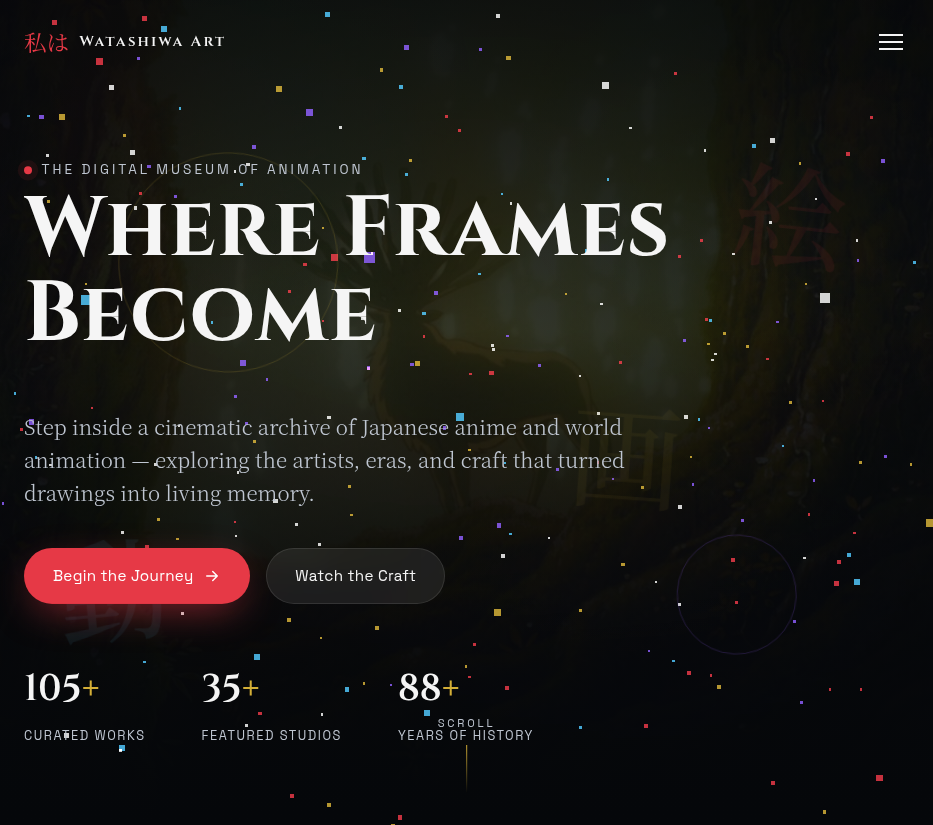
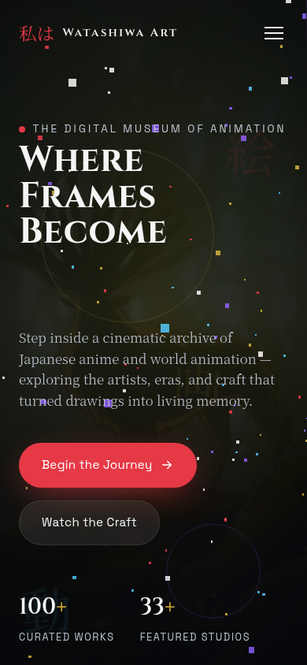

# Watasiwa Art

A modern anime-inspired digital art and storytelling website built with Next.js.

🌐 Live Demo: https://watasiwa-art.github.io/

---

## ✨ Features

- Responsive Design
- Modern UI/UX
- Anime-inspired aesthetic
- Smooth navigation
- Optimized for GitHub Pages
- Dark Theme
- Fast Loading

---

## 🛠️ Built With

- Next.js
- React
- TypeScript
- Tailwind CSS
- Framer Motion (if used)
- GitHub Pages

---

## 📸 Screenshots

### Desktop



### Mobile



---

## 🚀 Getting Started

Clone the repository

```bash
git clone https://github.com/watasiwa-art/watasiwa-art.github.io.git
```

Install dependencies

```bash
npm install
```

Run development server

```bash
npm run dev
```

Build project

```bash
npm run build
```

---

## 📁 Project Structure

```
app/
components/
public/
styles/
```

---

## 🎯 Goals

This project aims to create an immersive anime-inspired web experience that combines storytelling, digital art, and modern web technologies.

---

## 🔮 Future Improvements

- Scroll animations
- Gallery section
- Dark/Light mode
- Performance optimization
- Accessibility improvements


Made with ❤️ by Nahian Ahmed Nirob
